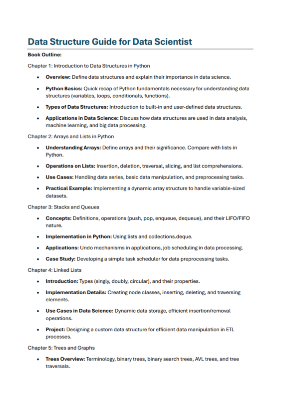
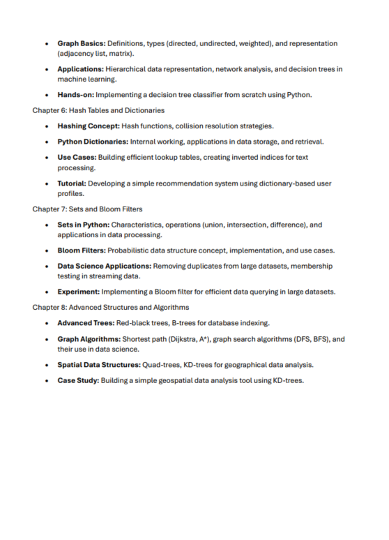

# Data Structure for Data Science
|  |  |
| ----------------------- | ----------------------- |

**Book Outline:**
---
**Chapter 1: Introduction to Data Structures in Python**

- **Overview:** Define data structures and explain their importance in data science.
- **Python Basics:** Quick recap of Python fundamentals necessary for understanding data structures (variables, loops, conditionals, functions).
- **Types of Data Structures:** Introduction to built-in and user-defined data structures.
- **Applications in Data Science:** Discuss how data structures are used in data analysis, machine learning, and big data processing.

**Chapter 2: Arrays and Lists in Python**

- **Understanding Arrays:** Define arrays and their significance. Compare with lists in Python.
- **Operations on Lists:** Insertion, deletion, traversal, slicing, and list comprehensions.
- **Use Cases:** Handling data series, basic data manipulation, and preprocessing tasks.
- **Practical Example:** Implementing a dynamic array structure to handle variable-sized datasets.

**Chapter 3: Stacks and Queues**

- **Concepts:** Definitions, operations (push, pop, enqueue, dequeue), and their LIFO/FIFO nature.
- **Implementation in Python:** Using lists and collections.deque.
- **Applications:** Undo mechanisms in applications, job scheduling in data processing.
- **Case Study:** Developing a simple task scheduler for data preprocessing tasks.

**Chapter 4: Linked Lists**

- **Introduction:** Types (singly, doubly, circular), and their properties.
- **Implementation Details:** Creating node classes, inserting, deleting, and traversing elements.
- **Use Cases in Data Science:** Dynamic data storage, efficient insertion/removal operations.
- **Project:** Designing a custom data structure for efficient data manipulation in ETL processes.

**Chapter 5: Trees and Graphs**

- **Trees Overview:** Terminology, binary trees, binary search trees, AVL trees, and tree traversals.
- **Graph Basics:** Definitions, types (directed, undirected, weighted), and representation (adjacency list, matrix).
- **Applications:** Hierarchical data representation, network analysis, and decision trees in machine learning.
- **Hands-on:** Implementing a decision tree classifier from scratch using Python.

**Chapter 6: Hash Tables and Dictionaries**

- **Hashing Concept:** Hash functions, collision resolution strategies.
- **Python Dictionaries:** Internal working, applications in data storage, and retrieval.
- **Use Cases:** Building efficient lookup tables, creating inverted indices for text processing.
- **Tutorial:** Developing a simple recommendation system using dictionary-based user profiles.

**Chapter 7: Sets and Bloom Filters**

- **Sets in Python:** Characteristics, operations (union, intersection, difference), and applications in data processing.
- **Bloom Filters:** Probabilistic data structure concept, implementation, and use cases.
- **Data Science Applications:** Removing duplicates from large datasets, membership testing in streaming data.
- **Experiment:** Implementing a Bloom filter for efficient data querying in large datasets.

**Chapter 8: Advanced Structures and Algorithms**

- **Advanced Trees:** Red-black trees, B-trees for database indexing.
- **Graph Algorithms:** Shortest path (Dijkstra, A*), graph search algorithms (DFS, BFS), and their use in data science.
- **Spatial Data Structures:** Quad-trees, KD-trees for geographical data analysis.
- **Case Study:** Building a simple geospatial data analysis tool using KD-trees.

